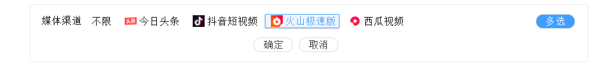

### 复选组件v1
### multiple-filter 组件

- Attributes

| 参数               | 类型             | 是否必须   | 说明                                                       | 默认值   |
| ----------------- | ---------------- | -------- | ---------------------------------------------------------- | -------- |
| data              | Object[]         | 是       | 数据                                                        |          |
| prop              | Object           | 否       | 配置项                                                      |          |
| -key              | String           | 否       | 唯一索引对应 key                                             | id       |
| -label            | String           | 否       | 展示文字对应 key                                             | label    |
| -value            | String           | 否       | 对应返回的value的key                                         | value   |
| -icon             | String           | 否       | 展示的图标地址                                               | icon     |
| label             | String           | 是       | 标题                                                        |         |
| firstSetting      | Object           | 否       | 首个节点的配置项                                             |       |
| -show             | Boolean          | 是       | 是否展示首个节点                                             | true     |
| -item             | Object           | 否       | 首项数据,对应结构为prop字段                                   | {label:"不限",id:-1,value:-1}   |
| multiple          | Boolean          | 否       | 是否支持多选                                                 | false    |
| open              | Boolean          | 否       | 超过一行是否默认展开                                          | false   |
| singleH           | Number           | 否       | 单行文本高度                                                 | 50       |
| value             | prop.key[]       | 是       | 绑定值,支持v-model                                           |        |

- Events

| 参数             | 说明         | 回调参数                       |
| ---------------- | ------------ | ------------------------------ |
| change    | 选择改变事件 | 选中的prop.key[] |

- Methods

| 参数            | 说明                          | 参数        |
| --------------- | ----------------------------- | ----------- |
| reset           | 重置                         |                 |
| getChecked      | 获取当前选中,返回item[]                  |       传入时获取对应选项,不传为已选:prop.key[]        |

#### 多选 不展示首项


```vue
<template>
  <mutiple-filter label="媒体渠道"
                  v-model="mediaData"
                  :firstSetting='firstSetting'
                  :prop='prop'
                  :multiple="true"
                  :data='mediaList'
                  @change="changeHandle"
  ></mutiple-filter>
</template>

<script>
import MutipleFilter from "./index.vue";

export default {
  data() {
    return {
      mediaData: [3],
      mediaList: [
        {
          "id": 1,
          "label": "今日头条",
          "value": "Beijing Bytedance Technology Co., Ltd.",
          "code": "TOUTIAO",
          "icon": "https://is5-ssl.mzstatic.com/image/thumb/Purple124/v4/59/b3/69/59b369f6-2bbb-0073-dded-75fb1a80bc34/source/1024x1024bb.jpg",
          "group": ["OCEAN_ENGINE"]
        }, {
          "id": 2,
          "label": "抖音短视频",
          "value": "Beijing Microlive Vision Technology Co., Ltd",
          "code": "DOUYIN",
          "icon": "https://is4-ssl.mzstatic.com/image/thumb/Purple114/v4/e6/70/f0/e670f0a8-6321-a5ff-566f-bc401e1e33c5/AppIcon-1x_U007emarketing-0-6-0-85-220.png/1024x1024bb.jpeg",
          "group": ["OCEAN_ENGINE"]
        }, {
          "id": 3,
          "label": "火山极速版",
          "value": "Beijing Microlive Vision Technology Co., Ltd",
          "code": "HUOSHAN",
          "icon": "https://is2-ssl.mzstatic.com/image/thumb/Purple123/v4/00/22/6b/00226b76-cdab-c8e7-a69e-ab900abc473e/source/1024x1024bb.jpg",
          "group": ["OCEAN_ENGINE"]
        }, {
          "id": 4,
          "label": "西瓜视频",
          "value": "Beijing Bytedance Technology Co., Ltd.",
          "code": "XIGUA",
          "icon": "https://is4-ssl.mzstatic.com/image/thumb/Purple124/v4/54/fe/01/54fe0109-140b-d9bc-5d0f-adfba55f756e/AppIcon-0-0-1x_U007emarketing-0-0-0-7-0-0-85-220.png/1024x1024bb.jpeg",
          "group": ["OCEAN_ENGINE"]
        }],
      firstSetting: { item: { label: "不限", id: "-1", value: "-1" }, show: false },
      prop: { label: "label", key: "id", value: "id", icon: "icon" }
    };
  },
  methods: {
    changeHandle(list) {
      this.mediaData = list;
    }
  },
  components: {
    MutipleFilter
  }
};
</script>
```

#### 单选 展示首项


```vue
<template>
  <mutiple-filter label="媒体渠道"
                  v-model="mediaData"
                  :firstSetting='firstSetting'
                  :prop='prop'
                  :multiple="false"
                  :data='mediaList'
                  @change="changeHandle"
  ></mutiple-filter>
</template>

<script>
import MutipleFilter from "./index.vue";

export default {
  data() {
    return {
      mediaData: [3],
      mediaList: [
        {
          "id": 1,
          "label": "今日头条",
          "value": "Beijing Bytedance Technology Co., Ltd.",
          "code": "TOUTIAO",
          "icon": "https://is5-ssl.mzstatic.com/image/thumb/Purple124/v4/59/b3/69/59b369f6-2bbb-0073-dded-75fb1a80bc34/source/1024x1024bb.jpg",
          "group": ["OCEAN_ENGINE"]
        }, {
          "id": 2,
          "label": "抖音短视频",
          "value": "Beijing Microlive Vision Technology Co., Ltd",
          "code": "DOUYIN",
          "icon": "https://is4-ssl.mzstatic.com/image/thumb/Purple114/v4/e6/70/f0/e670f0a8-6321-a5ff-566f-bc401e1e33c5/AppIcon-1x_U007emarketing-0-6-0-85-220.png/1024x1024bb.jpeg",
          "group": ["OCEAN_ENGINE"]
        }, {
          "id": 3,
          "label": "火山极速版",
          "value": "Beijing Microlive Vision Technology Co., Ltd",
          "code": "HUOSHAN",
          "icon": "https://is2-ssl.mzstatic.com/image/thumb/Purple123/v4/00/22/6b/00226b76-cdab-c8e7-a69e-ab900abc473e/source/1024x1024bb.jpg",
          "group": ["OCEAN_ENGINE"]
        }, {
          "id": 4,
          "label": "西瓜视频",
          "value": "Beijing Bytedance Technology Co., Ltd.",
          "code": "XIGUA",
          "icon": "https://is4-ssl.mzstatic.com/image/thumb/Purple124/v4/54/fe/01/54fe0109-140b-d9bc-5d0f-adfba55f756e/AppIcon-0-0-1x_U007emarketing-0-0-0-7-0-0-85-220.png/1024x1024bb.jpeg",
          "group": ["OCEAN_ENGINE"]
        }],
      firstSetting: { item: { label: "不限", id: "-1", value: "-1" }, show: true },
      prop: { label: "label", key: "id", value: "id", icon: "icon" }
    };
  },
  methods: {
    changeHandle(list) {
      this.mediaData = list;
    }
  },
  components: {
    MutipleFilter
  }
};
</script>
```


### 复选组件v2

## README multiple-filter 组件v2(同时支持单选和多选)

- Attributes

| 参数               | 类型             | 是否必须   | 说明                                                       | 默认值   |
| ----------------- | ---------------- | -------- | ---------------------------------------------------------- | -------- |
| data              | Object[]         | 是       | 数据                                                        |          |
| prop              | Object           | 否       | 配置项                                                      |          |
| -key              | String           | 否       | 唯一索引对应 key                                             | id       |
| -label            | String           | 否       | 展示文字对应 key                                             | label    |
| -value            | String           | 否       | 对应返回的value的key                                         | value   |
| -icon             | String           | 否       | 展示的图标地址                                               | icon     |
| label             | String           | 是       | 标题                                                        |         |
| firstSetting      | Object           | 否       | 首个节点的配置项                                             |       |
| -show             | Boolean          | 是       | 是否展示首个节点                                             | true     |
| -item             | Object           | 否       | 首项数据,对应结构为prop字段                                   | {label:"不限",id:-1,value:-1}   |
| multiple          | Boolean          | 否       | 是否允许多选(单选+多选同时支持)                                | false    |
| open              | Boolean          | 否       | 超过一行是否默认展开                                          | false   |
| singleH           | Number           | 否       | 单行文本高度                                                 | 50       |
| value             | prop.key[]       | 是       | 绑定值,支持v-model                                           |        |

- Events

| 参数             | 说明         | 回调参数                       |
| ---------------- | ------------ | ------------------------------ |
| change    | 选择改变事件 | 选中的prop.key[] |

- Methods

| 参数            | 说明                          | 参数        |
| --------------- | ----------------------------- | ----------- |
| reset           | 重置                         |                 |
| getChecked      | 获取当前选中,返回item[]                  |       传入时获取对应选项,不传为已选:prop.key[]        |


```vue
<template>
  <mutiple-filter label="媒体渠道"
                  v-model="mediaData"
                  :firstSetting='firstSetting'
                  :prop='prop'
                  :multiple="true"
                  :data='mediaList'
                  @change="changeHandle"
  ></mutiple-filter>
</template>

<script>
import MutipleFilter from "./index.vue";

export default {
  data() {
    return {
      mediaData: [3],
      mediaList: [
        {
          "id": 1,
          "label": "今日头条",
          "value": "Beijing Bytedance Technology Co., Ltd.",
          "code": "TOUTIAO",
          "icon": "https://is5-ssl.mzstatic.com/image/thumb/Purple124/v4/59/b3/69/59b369f6-2bbb-0073-dded-75fb1a80bc34/source/1024x1024bb.jpg",
          "group": ["OCEAN_ENGINE"]
        }, {
          "id": 2,
          "label": "抖音短视频",
          "value": "Beijing Microlive Vision Technology Co., Ltd",
          "code": "DOUYIN",
          "icon": "https://is4-ssl.mzstatic.com/image/thumb/Purple114/v4/e6/70/f0/e670f0a8-6321-a5ff-566f-bc401e1e33c5/AppIcon-1x_U007emarketing-0-6-0-85-220.png/1024x1024bb.jpeg",
          "group": ["OCEAN_ENGINE"]
        }, {
          "id": 3,
          "label": "火山极速版",
          "value": "Beijing Microlive Vision Technology Co., Ltd",
          "code": "HUOSHAN",
          "icon": "https://is2-ssl.mzstatic.com/image/thumb/Purple123/v4/00/22/6b/00226b76-cdab-c8e7-a69e-ab900abc473e/source/1024x1024bb.jpg",
          "group": ["OCEAN_ENGINE"]
        }, {
          "id": 4,
          "label": "西瓜视频",
          "value": "Beijing Bytedance Technology Co., Ltd.",
          "code": "XIGUA",
          "icon": "https://is4-ssl.mzstatic.com/image/thumb/Purple124/v4/54/fe/01/54fe0109-140b-d9bc-5d0f-adfba55f756e/AppIcon-0-0-1x_U007emarketing-0-0-0-7-0-0-85-220.png/1024x1024bb.jpeg",
          "group": ["OCEAN_ENGINE"]
        }],
      firstSetting: { item: { label: "不限", id: "-1", value: "-1" }, show: true },
      prop: { label: "label", key: "id", value: "id", icon: "icon" }
    };
  },
  methods: {
    changeHandle(list) {
      this.mediaData = list;
    }
  },
  components: {
    MutipleFilter
  }
};
</script>
```


